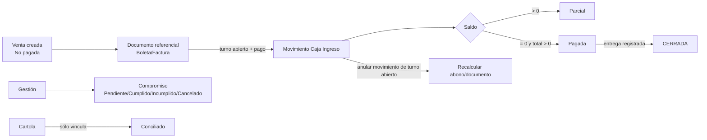
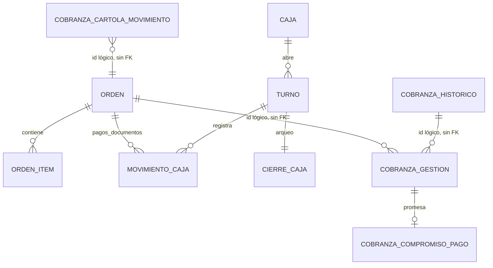

# Auditoría de Cobranza dentro de Caja

**Fecha:** 2026-09-03  
**Código auditado:** rama local `remediacion-auditoria-2026-09-01`, HEAD `78743db`  
**Datos consultados:** espejo local `plastimar_test`, sin escrituras. No se consultó ni modificó producción.  
**Método:** inspección de código/rutas/Prisma, navegación en `http://127.0.0.1:5173/cobranza`, consultas SQL de sólo lectura y pruebas automatizadas contra el espejo.

## Resumen ejecutivo

El núcleo transaccional de cobro de una venta está bien defendido: exige ambos permisos (`cobranza` y `caja`), un turno abierto, documento referencial, bloqueos `FOR UPDATE`, transacción y control de sobrepago. Las pruebas focalizadas aprobaron **61/61**. La apertura/cierre de turno y la reversa de pagos también tienen bloqueo transaccional.

No está listo para considerar Cobranza multi-sucursal segura: Gestión, Alertas y Cartola no aplican alcance de sucursal, por lo que un usuario con cobranza podría consultar o escribir seguimiento de otra sucursal si conoce los IDs. Además, los importes monetarios siguen siendo `Float`, que es inadecuado para dinero fiscal/contable. El tablero gerencial y el Dashboard usan la cartera histórica, no la misma cartera operativa de la pantalla Por Cobrar.

En los datos reales del espejo hay deuda histórica que contamina la operación: la vista Por Cobrar presenta 784 ventas, de las cuales **155 tienen total $0** pero estado `No pagada`; el botón Pagar queda visible. La aplicación no permite cobrarles, pero la bandeja y KPI las tratan como deuda. Hay también 105 históricos pendientes con valor $0 y 5 `cobranza_historico.orden_id` sin orden existente.

## Alcance y evidencia reproducible

### Puntos de entrada

| Pieza | Evidencia |
|---|---|
| Menú | `frontend/src/components/TopBar.jsx:72-76`: Caja → Movimientos y Cobranza. |
| Rutas UI | `frontend/src/router.jsx:117-123`: `/caja`, `/caja/nuevo` y `/cobranza/*`. |
| API | `backend/src/app.js:101,105` registra `/api/caja` y `/api/cobranza-historico`. |
| Cobro | `backend/src/routes/caja/movimientos.js:388-585`, `POST /cobranza/orden/:id/pago`. |
| Documento previo | `backend/src/routes/caja/movimientos.js:309-386`, `POST /cobranza/orden/:id/documento`. |
| Turnos | `backend/src/routes/caja/turno.js:43-188`. |
| Gestión/Cartola | `backend/src/routes/cobranza/gestion.js:133-316`. |
| Estados históricos | `backend/src/routes/cobranza/estados.js:4` y normalización usada en `backend/src/routes/cobranza/index.js:31-35`. |
| Consumidores aguas abajo | `backend/src/routes/dashboard/stats.js:36,94-99,177-180`; `backend/src/routes/reportes/index.js:1391-1460`. |
| Documento contextual | `TRAZABILIDAD_PLASTIMAR.md` fue revisado como contexto; no sustituye evidencia de Cobranza/Caja. |

### Pruebas ejecutadas

Se ejecutó contra `.env.test.docker` y PostgreSQL local `plastimar_test`:

```text
node --env-file=.env.test.docker ./node_modules/vitest/vitest.mjs run \
  test/caja-traceability.test.js test/cobranza-cliente.test.js \
  test/cobranza-gestion.test.js test/cobranza-pagos-proveedores.test.js \
  test/cu02-venta-web-pago.test.js test/dashboard-por-rol.test.js \
  test/permisos-front-back-coinciden.test.js test/operational.test.js --reporter=verbose

8 archivos, 61 pruebas aprobadas.
```

Cobertura destacada: trazabilidad y reversa de pago (`backend/test/caja-traceability.test.js:26,156`), gestión/compromisos/cartola (`backend/test/cobranza-gestion.test.js:8,34`), cliente (`backend/test/cobranza-cliente.test.js:19`), venta web/pago (`backend/test/cu02-venta-web-pago.test.js:15,49,80`), Dashboard por rol (`backend/test/dashboard-por-rol.test.js:95`) y equivalencia de permisos frontend/backend (`backend/test/permisos-front-back-coinciden.test.js:18,24`).

También se ejecutó `npm run build` en frontend: aprobado. El empaquetador advierte un bundle principal mayor a 500 kB, riesgo de rendimiento general pero no un fallo funcional de Cobranza.

## Datos actuales del espejo

| Medición de sólo lectura | Resultado | Interpretación |
|---|---:|---|
| Usuarios / clientes / productos / órdenes / ODT / movimientos de caja | 177 / 16.677 / 37.228 / 16.421 / 5.783 / 36.879 | El espejo contiene volumen operativo real, no datos semilla. |
| Vista activa Por Cobrar, filtro por defecto No pagadas | 784 ventas | Coincide con la UI navegada. |
| De esas 784, total calculado $0 | 155 | Inconsistencia de datos/estado: se muestran como deuda sin importe cobrable. |
| Más de 30 días en consulta SQL | 633 | La UI mostró 631; la diferencia depende del momento exacto del cálculo de días, no altera el diagnóstico. |
| Histórico Cobranza | 3.993 registros; 106 pendientes | 105 de los pendientes tienen `valor_factura <= 0`. |
| Histórico enlazado a orden inexistente | 5 | Huérfanos por modelo sin FK. |
| Movimientos Caja activos sin turno | 36.783 | Legado/importación; el flujo nuevo sí exige turno. |
| Movimientos de orden activos sin `usuario` | 48 | Trazabilidad histórica incompleta. |
| Gestiones / compromisos / cartola | 0 / 0 / 0 | Código disponible, pero aún sin evidencia de uso operativo cargada. |
| Turnos abiertos | 1 | La interfaz permite practicar el cobro, sin necesidad de abrir un turno adicional. |

La vista viva mostró el primer bloque de documentos de 2016, saldo total pendiente `$878.2M`, 784 documentos y botones **Pagar / Gestionar / Seguimiento**. Se abrió solamente la pantalla, filtros y árbol de accesibilidad; no se registraron pagos, documentos, gestiones ni movimientos.

## Flujo operativo y máquina de estados



- La venta parte sin abono y `No pagada`; creación y edición rechazan que Ventas altere abono, facturado o estado de pago: `backend/src/routes/ventas/create.js:121-125`, `backend/src/routes/ventas/update.js:168-172`.
- El estado financiero se deriva de ítems, cargos, pagos, multas y NC internas: `backend/src/routes/ventas/financial.js:28-64`. Estados: `No pagada`, `Parcial`, `Pagada`.
- Un pago sólo se admite contra un documento referencial activo. Es una separación correcta entre obligación documental y efectivo: `backend/src/routes/caja/movimientos.js:143-191`.
- Si pago y entrega se cumplen, la orden adopta `ENTREGADA` y luego `CERRADA` en la misma transacción: `backend/src/routes/caja/movimientos.js:553-567`, `backend/src/routes/ventas/estado-flujo-formal.js:152-171`.
- Los estados de cobranza histórica son independientes: `CANCELADA`, `PENDIENTE`, `NULA`; no deben confundirse con el `estadoPago` de la venta actual.

## Matriz exhaustiva de acciones

| Acción UI / handler | Endpoint y validación | Efecto y transacción | Permiso y estado de habilitación | Feedback / idempotencia |
|---|---|---|---|---|
| Ver cartera activa | `useVentas` → `GET /api/ventas`; filtros en `backend/src/routes/ventas/list.js:36-180` | Sólo lectura de órdenes, ítems, cargos, pagos, multas y NC; calcula saldo | Ruta pide `cobranza:read`, endpoint pide `ventas:read` | Loading/error en `CobranzaPage.jsx:614-627`; paginación. Véase hallazgo RBAC condicional. |
| Registrar documento referencial | `POST /api/caja/cobranza/orden/:id/documento`; Zod `movimientos.js:56-63` | Bloquea orden, toma lock asesor sobre documento, crea `MovimientoCaja` referencial y sincroniza estado: `309-379` | `cobranza:write` + `caja:write` | 201 o 400/404/409. Lock evita duplicado concurrente pese a no haber índice único físico. |
| Registrar abono | Modal/`submitPayment`, `CobranzaPage.jsx:241-268` → `POST .../pago` | Bloquea turno y orden, comprueba documento/saldo, incrementa abono de forma condicional, crea movimiento, actualiza CRM y flujo: `388-581` | `cobranza:write`, `caja:read`, `caja:write`; botón deshabilitado sin turno o mutación pendiente: `79-80`, `335-345` | Toast éxito/error; botón final deshabilitado mientras muta y hasta seleccionar documento: `197-205`, `743-745`. Reintento concurrente responde 409. |
| Crear movimiento manual | Caja nueva → `POST /api/caja/turno/:id/movimientos` | Lock `FOR UPDATE` de turno y creación atómica: `588-646` | `caja:write`, turno abierto | Zod y guardas impiden pago de venta manual y exigen origen para egreso: `movimientos.js:244-306`. |
| Abrir turno | `CajaPage.handleAbrirTurno` → `POST /api/caja/turno` | Advisory lock por sucursal y verificación de turno ya abierto: `turno.js:61-84` | `caja:write` | Confirmación UI; 409 si existe turno. |
| Cerrar turno/arqueo | `POST /api/caja/turno/:id/cerrar` | Lock de turno, totaliza, actualiza cierre y `upsert` de snapshot: `turno.js:86-175` | `caja:write`, sólo abierto | Confirmación reforzada y diferencia mostrada: `CajaPage.jsx:145-157`. Segundo cierre devuelve 400. |
| Anular pago/movimiento | `DELETE /api/caja/movimientos/:id`, motivo obligatorio | Lock movimiento y orden, revierte abono, anula y recalcula: `movimientos.js:649-728` | `caja:delete`, no turno cerrado | Confirmación + motivo: `CajaPage.jsx:160-167`; 409 si ya anulado/cerrado. |
| Reactivar movimiento | `PATCH /api/caja/movimientos/:id/reactivar` | Lock, controla duplicado de documento y recalcula venta: `730-812` | `caja:delete`, movimiento anulado y turno abierto | Confirmación + motivo; 409 ante estado incompatible. |
| Registrar gestión / promesa | `CobranzaGestionPanel.submitGestion` → `POST /gestiones` | Transacción crea gestión y compromiso juntos: `gestion.js:150-183` | `cobranza:write`; botón espera mutación | Toast y formulario se limpia: `CobranzaGestionPanel.jsx:77-103`. No hay clave de idempotencia: doble solicitud posterior al reintento crea dos notas. |
| Resolver compromiso | `PATCH /compromisos/:id` | Actualiza estado y fecha de cumplimiento: `gestion.js:186-204` | `cobranza:write` | Botones bloqueados en mutación, toast: `105-109`, `163-166`. |
| Importar cartola | `POST /cartola/importar` | `createMany(skipDuplicates)` con fingerprint SHA-256: `gestion.js:64-74,264-276` | `cobranza:write` | Idempotencia por fingerprint; toast con importados/duplicados: `112-120`. |
| Conciliar cartola | `POST /cartola/:id/conciliar` | Marca vínculo a orden/histórico/movimiento: `gestion.js:278-301` | `cobranza:write` | Toast. No registra pago, correctamente explicitado en UI: `CobranzaGestionPanel.jsx:192-203`. Tiene carrera pendiente. |
| Descartar cartola | `POST /cartola/:id/descartar` | Cambia estado, prohíbe descartado conciliado: `gestion.js:303-315` | `cobranza:write` | Toast; idempotencia imperfecta pero update repetido es estable. |

## Seguridad, aislamiento y concurrencia

### Controles comprobados

- La matriz de roles da a `cajero` caja y cobranza de lectura/escritura: `backend/src/middleware/rbac.js:34-40`; `solo_lectura` sólo lectura: `68-86`.
- Las pruebas verifican catálogo de roles y función `can()` igual entre frontend/backend: `backend/test/permisos-front-back-coinciden.test.js:18-24`.
- Turno, pago, reversa y reactivación bloquean filas relevantes con `FOR UPDATE`; apertura usa un advisory lock por sucursal: `backend/src/routes/caja/turno.js:66-76`, `backend/src/routes/caja/movimientos.js:402-434,657-688,738-774`.
- El alta del documento usa advisory lock sobre `(sucursal, tipo documento, número)`: `backend/src/routes/caja/movimientos.js:75-104`.
- El `updateMany` condicional de abono fuerza 409 si otro cajero cambió el saldo: `backend/src/routes/caja/movimientos.js:495-510`.
- Caja aplica alcance por sucursal a turnos y movimientos: `backend/src/routes/caja/scope.js:1-32`.

### Hallazgos priorizados

| Prioridad | Hallazgo verificable | Riesgo | Remediación concreta |
|---|---|---|---|
| **P0** | Gestión, Alertas y Cartola no aplican alcance de sucursal. `gestion.js:137-148,206-236,264-315` consulta/escribe por IDs globales; `assertTargetExists` (`81-94`) sólo comprueba existencia. En cambio el histórico sí genera scope por sucursal: `cobranza/scope.js:10-24`. | Fuga y modificación de seguimiento/cartola entre sucursales para cualquier perfil con `cobranza:read/write`. | Centralizar `assertCobranzaTargetInScope`; aplicar `buildCobranzaHistoricoScopeWhere` o relación de orden a los GET/POST/PATCH. Para Cartola, persistir `sucursalId` y filtrar todas las operaciones. Agregar pruebas de aislamiento. |
| **P0** | Todo el dinero relevante es `Float`: venta/ítem `schema.prisma:598-603,694-696`, caja `1330-1369`, cierre `1372-1404`, cobranza/carta/compromiso `720-750,771-819`. | Redondeos binarios, diferencias entre total, pagos, arqueo, comisión y reportes. Es especialmente serio al emitir/cobrar. | Migrar de forma planificada a `Decimal(18,2)` o entero CLP, adaptar cálculos y pruebas de regresión. No hacer cambio masivo sin plan/migración de datos. |
| **P1** | La conciliación hace lectura y luego `update` sin transacción ni condición `estado='PENDIENTE'`: `gestion.js:278-301`. | Dos cobradores pueden conciliar el mismo movimiento con destinos distintos; el último gana y la evidencia se pierde. | `UPDATE ... WHERE id AND estado='PENDIENTE'` dentro de transacción/lock; devolver 409 si `count=0`, con test de carrera. |
| **P1** | Por Cobrar incluye 155 ventas de total $0 como `No pagada`; el usuario ve Pagar, pero el handler sólo avisa al clic: `CobranzaPage.jsx:332-345`. En histórico hay 105 pendientes con valor $0. | KPI `$878.2M`, antigüedad y priorización mezclan deuda no cobrable; aumenta clics y decisiones erróneas. | Decisión de datos: anular/corregir estados históricos o marcar como saldo $0/no cobrable. En UI/API excluir saldo 0 por defecto y deshabilitar Pagar con explicación hasta depuración. |
| **P1** | Dashboard sólo calcula `cobranzaHistorico` (`dashboard/stats.js:36,94-99,177-180`) y reportes gerenciales construyen CxC desde históricos (`reportes/index.js:1396-1458`), mientras Por Cobrar usa `ventas.ordenes` (`ventas/list.js:161-236`). | Gerencia puede ver una cartera distinta a la cartera operativa. Hoy: 784 ventas activas vs 106 históricos pendientes. | Definir fuente canónica de CxC y exponer explícitamente histórico vs operativo; reconciliar y agregar test que compare indicadores definidos. |
| **P1** | `CobranzaHistorico.ordenId` no tiene relación Prisma/FK (`schema.prisma:720-750`); existen 5 referencias huérfanas en el espejo. Gestión y Cartola repiten IDs sin relaciones (`753-819`). | Historial/seguimiento puede quedar desconectado de venta, sin integridad referencial. | Corregir los 5 registros con decisión de datos; luego agregar FKs/relaciones de forma migrable o validadores de integridad programados. |
| **P2** | La página pide `cobranza:read` (`router.jsx:123`) pero su fuente activa exige `ventas:read` (`ventas/list.js:32-35`). Los roles estándar aprobados por test contienen ambos; una asignación granular puede terminar en pantalla accesible con 403. | UX/RBAC inconsistente al usar permisos extra personalizados. | Proteger ruta con ambos permisos o crear endpoint de cartera bajo Cobranza; cubrir perfil sólo-cobranza. |
| **P2** | La lista calcula estadísticas cargando todas las órdenes, ítems y cargos filtrados: `ventas/list.js:167-180,226-236`; luego hace productos por cada fila visible: `203-218`. | A medida que cartera crezca, latencia y memoria del VPS aumentan; es un patrón N+1 por página y carga total para KPIs. | Consultas agregadas para KPI, incluir productos en lote para todas las filas, medición APM y límite/índices por filtros frecuentes. |
| **P2** | 36.783 movimientos activos no pertenecen a turno y 48 de orden no tienen usuario (datos espejo). El flujo nuevo lo evita, pero Caja histórico muestra “—” como usuario: `CajaPage.jsx:221-233`. | Auditoría de caja previa queda incompleta y puede ser confundida con operaciones contemporáneas. | Etiquetar “legado/sin turno/sin actor” y definir plan de backfill o fecha de corte para indicadores. |
| **P2** | El modal de pago enfoca el diálogo y permite Escape (`CobranzaPage.jsx:160-171`), pero no implementa focus trap; dos filtros de texto se exponen sin etiqueta accesible (árbol vivo los mostró anónimos; código `456-457`). | Navegación de teclado y lector de pantalla parcial, especialmente en caja. | Añadir `aria-label`/`label` a filtros, trap de foco/restitución al disparador y prueba Playwright de Tab/Escape/Enter. |
| **P3** | Gestión y Cartola existen pero no tienen datos en el espejo (0 gestiones, 0 compromisos, 0 cartola). | No hay validación operativa real de alertas, conciliación ni timeline. | Cargar casos de prueba controlados en entorno de certificación y ejecutar recorrido E2E por cajero/cobrador. |

## UX/UI contrastada en vivo

### Lo que funciona

- La vista real cargó datos y los tres tabs. KPIs, tabla semántica, filtros, paginación y acciones se renderizan correctamente; el árbol de accesibilidad identifica la tabla como “Documentos pendientes de cobro”.
- La modal separa monto, medio, documento, cuotas, voucher y referencia; exige documento referencial y deshabilita “Registrar pago” hasta que el formulario sea válido: `CobranzaPage.jsx:672-747`.
- Hay loaders, estados de error y mensajes vacíos explícitos en cartera, histórico y Gestión: `CobranzaPage.jsx:614-669`, `CobranzaGestionPanel.jsx:153-211`.
- Gestión es responsive en código: la grilla pasa a una columna a 980 px y el formulario a una a 700 px; la tabla horizontal queda envuelta: `CobranzaGestionPanel.css:15-16,40-57`.
- Acciones destructivas de Caja piden confirmación y motivo: `CajaPage.jsx:160-175`; cierre pide confirmación con diferencia: `151-157`.

### Brechas observadas

1. La prioridad por defecto pone al comienzo documentos de 2016 (más de 3.500 días), incluido registro de venta $0. Es coherente con ordenar deuda más antigua, pero sin separar legado/deuda vigente no es una cola de trabajo efectiva.
2. El botón **Pagar** es visible para saldo cero; el click da aviso, no un bloqueo visual preventivo. Esto es una discrepancia de UI respecto de la regla real.
3. La interfaz principal tiene muchas columnas y filtros en dos bandas; en escritorio es legible, pero la densidad requiere desplazamiento horizontal y una estrategia móvil comprobada. La revisión se hizo en navegador de escritorio; no se declaró una certificación de touch/POS.
4. El gestor de Cartola es deliberadamente una vinculación y no una creación de pago. Es correcto técnicamente, pero el texto debe permanecer inequívoco para evitar que el operador asuma que conciliación recaudó dinero.

## Modelo y consistencia



Las relaciones fuertes de Caja hacia turno/orden y el `onDelete: SetNull` de movimiento-orden están definidas en `backend/prisma/schema.prisma:1314-1404`. En contraste, Cobranza Histórica, Gestión, Compromisos y Cartola almacenan IDs sin relaciones Prisma (`720-819`); esta diferencia explica que haya vínculos históricos huérfanos.

## Conclusión de disponibilidad

| Área | Estado | Condición de cierre |
|---|---|---|
| Cobro venta → Caja → estado de orden | **Operativo con controles fuertes** | Mantener pruebas de concurrencia y migrar tipos monetarios antes de uso contable/fiscal de alta criticidad. |
| Turno, arqueo, reversa | **Operativo** | Datos legados deben etiquetarse, no reinterpretarse como turnos modernos. |
| Gestión y compromisos | **Código terminado, uso no comprobado** | Corregir aislamiento por sucursal y ejecutar E2E con datos de certificación. |
| Importación/conciliación cartola | **Parcial** | Corregir concurrencia y aislamiento; luego probar con cartola real en certificación. |
| KPI/gerencia CxC | **Parcial y discrepante** | Definir fuente canónica y depurar deuda de total cero. |
| Seguridad multi-sucursal | **No cerrada** | Resolver P0 de scope antes de habilitar perfiles de sucursal en producción. |

## Orden recomendado de remediación

1. Aislamiento por sucursal de Gestión/Alertas/Cartola, con pruebas de lectura y escritura cruzada.
2. Definir fuente canónica de CxC y separar explícitamente cartera histórica, cartera operativa y documentos con saldo cero.
3. Decidir y ejecutar saneamiento de los 155 activos/105 históricos de valor cero y los 5 enlaces huérfanos, dejando bitácora de la decisión.
4. Hacer conciliación atómica y revalidable con `estado=PENDIENTE`.
5. Plan de migración monetaria `Float` → decimal/CLP entero, con conciliación de totales antes/después.
6. Optimizar agregaciones e índices de la cartera antes de crecer el volumen.
7. Completar accesibilidad/teclado y prueba real de tablet/POS.
8. Cargar y probar Gestión/Cartola en certificación sin tocar datos productivos.

## Límites de esta auditoría

- No se emitieron documentos fiscales, no se registraron pagos, no se abrió/cerró turno y no se modificó producción ni el espejo.
- Los resultados de datos describen el espejo `plastimar_test` al 2026-09-03; no son una autorización para corregir datos sin una decisión de negocio y respaldo.
- El suite completo tiene fallas ajenas a esta área en Bitácora/Notificaciones de Taller; no se usan para calificar Cobranza/Caja. Las 61 pruebas específicas de este alcance aprobaron.
