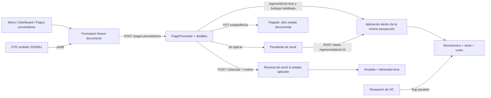
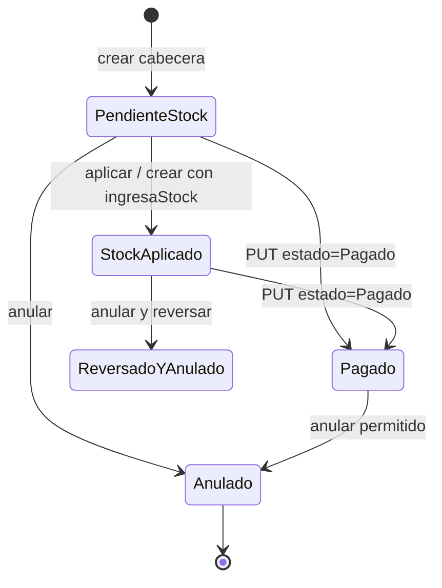
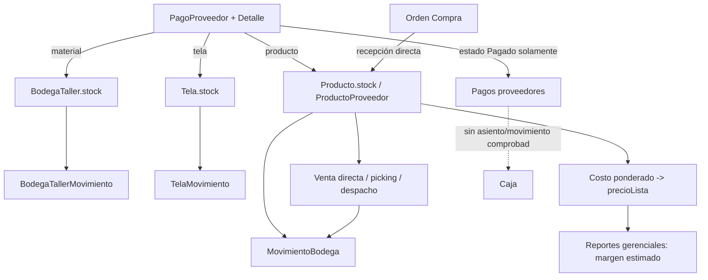

# Auditoría profunda — Ingreso Mercadería

**Fecha:** 2026-09-03
**Alcance:** código local de `remediacion-auditoria-2026-09-01`, interfaz sin sesión en `http://127.0.0.1:5173`, y consultas estrictamente de lectura al espejo Docker `plastimar_test`.
**Exclusiones:** no se modificó código, base de datos, producción ni se realizó push. No se ingresaron credenciales al navegador ni se ejecutaron pruebas que escriben en la base.

## Resumen ejecutivo

- La pantalla `/stock-ingresos` no representa una tabla propia de ingresos: lista documentos `PagoProveedor` con bodega, y crea el mismo recurso mediante `/api/pagos-proveedores`. [StockIngresosPage.jsx:84-88](../frontend/src/pages/stock-ingresos/StockIngresosPage.jsx#L84), [pagos-proveedores/index.js:483-596](../backend/src/routes/pagos-proveedores/index.js#L483)
- Hay tres entradas distintas al stock: documento manual/DTE recibido, recepción de orden de compra y movimientos manuales. La recepción de OC **no** crea un documento de ingreso ni se muestra en esta pantalla. [DocumentosRecibidosPage.jsx:33-39](../frontend/src/pages/facturacion/DocumentosRecibidosPage.jsx#L33), [ordenes-compra-proveedores/index.js:524-661](../backend/src/routes/ordenes-compra-proveedores/index.js#L524)
- Aplicar stock de un documento es transaccional e idempotente por documento; un bloqueo asesor evita dos aplicaciones simultáneas del mismo `pagoId`. [stock-ingresos/index.js:136-188](../backend/src/routes/stock-ingresos/index.js#L136)
- La protección no se extiende a cada producto/material/tela. Dos notas de crédito o anulaciones concurrentes pueden superar el prechequeo y llevar el stock a negativo. El flujo de ventas sí bloquea por producto, lo que confirma la brecha. [apply.js:238-253](../backend/src/routes/stock-ingresos/apply.js#L238), [apply.js:256-339](../backend/src/routes/stock-ingresos/apply.js#L256), [ventas/stock.js:19-23](../backend/src/routes/ventas/stock.js#L19)
- El costo de productos se recalcula como ponderado por proveedor y se escribe en `precioLista`; luego el reporte gerencial lo usa como una fuente de costo estimado. No se actualiza un precio de venta directamente. [costeo.js:1-48](../backend/src/routes/productos/costeo.js#L1), [reportes/index.js:912-927](../backend/src/routes/reportes/index.js#L912)
- El estado “Pagado” no es una segunda tabla: está en el mismo `PagoProveedor`. Sin embargo, el botón **Pagar** sólo hace un `PUT` de estado/fecha; no crea ni vincula movimiento de Caja, por lo que no acredita un pago financiero verificable. [PagosProveedoresPage.jsx:161-175](../frontend/src/pages/pagos-proveedores/PagosProveedoresPage.jsx#L161), [pagos-proveedores/index.js:608-670](../backend/src/routes/pagos-proveedores/index.js#L608)
- La pantalla carece de buscador general. El backend ya acepta `search`, pero no busca código/nombre de detalle; por tanto tampoco bastaría con agregar el control visual. [StockIngresosPage.jsx:58-85](../frontend/src/pages/stock-ingresos/StockIngresosPage.jsx#L58), [stock-ingresos/index.js:102-115](../backend/src/routes/stock-ingresos/index.js#L102)
- El filtro libre de proveedor debe pasar a selector/autocomplete. Existe una implementación reutilizable de proveedor con debounce, resultados y selección explícita en Factura de Compra. [StockIngresosPage.jsx:245](../frontend/src/pages/stock-ingresos/StockIngresosPage.jsx#L245), [EmitirFacturaCompraPage.jsx:10-19](../frontend/src/pages/facturacion/EmitirFacturaCompraPage.jsx#L10)
- El espejo `plastimar_test` no permite validar un caso real: tiene **0** cabeceras `pagos_proveedores`, **28.632** detalles sin cabecera y **0** movimientos vinculados a pagos. Además, la tabla efectiva no tiene FK de detalle a cabecera. Es una inconsistencia de ambiente/datos que debe resolverse antes de usarlo para una prueba E2E.
- Las pruebas unitarias específicas pasan (19/19), pero usan dobles en memoria; no prueban constraints reales ni carreras SQL. [stock-ingresos-apply.test.js:19-83](../backend/test/stock-ingresos-apply.test.js#L19)

## Método y límites de evidencia

| Fuente | Resultado | Límite |
|---|---|---|
| Código frontend/backend/schema/migraciones | Revisado con referencias de línea | Evidencia de comportamiento implementado, no de adopción real. |
| `npm run test:docker -- stock-ingresos-apply.test.js pagos-proveedores-stock.test.js` | 2 archivos, 19 pruebas, todas aprobadas | Son pruebas de helpers/rutas con mocks; no una transacción PostgreSQL concurrente. |
| Navegador local | La sesión estaba en `/login`; no se usaron credenciales | UI autenticada, atajos de teclado, responsive y respuestas de red: **no verificados**. |
| `plastimar_test` Docker, sólo lectura | 37.228 productos, 778 proveedores, 1.504 movimientos; 0 cabeceras de proveedor, 28.632 detalles huérfanos | No es muestra apta para certificar el flujo de ingreso actual. Producción no fue consultada. |

## Qué es un documento de ingreso

La UI ofrece **Factura**, **Boleta** y **Nota**; la Nota se trata como nota de crédito y aplica cantidad negativa. [StockIngresosPage.jsx:15-21](../frontend/src/pages/stock-ingresos/StockIngresosPage.jsx#L15), [apply.js:78-81](../backend/src/routes/stock-ingresos/apply.js#L78)

El backend normaliza esas tres variantes, pero acepta cualquier texto no vacío como `documento`; por API podría persistirse “Guía” sin una semántica específica ni control de negocio. [pagos-proveedores/index.js:46-54](../backend/src/routes/pagos-proveedores/index.js#L46), [pagos-proveedores/index.js:490-503](../backend/src/routes/pagos-proveedores/index.js#L490) No existe en la UI “ingreso sin documento”: `nDoc` es obligatorio. [StockIngresosPage.jsx:161-168](../frontend/src/pages/stock-ingresos/StockIngresosPage.jsx#L161)

`PagoProveedor` es la cabecera: proveedor, tipo/número, fechas, estado pago, total, bodega, marcas de aplicación/reversa y anulación. `DetalleFacturaProveedor` conserva código, destino, cantidad y precio por línea. [schema.prisma:463-499](../backend/prisma/schema.prisma#L463), [schema.prisma:549-564](../backend/prisma/schema.prisma#L549)

## Entradas, salidas y permisos

| Punto | Cómo llega / sale | Permiso efectivo |
|---|---|---|
| Menú Bodega | Navega a `/stock-ingresos`. [TopBar.jsx:59-70](../frontend/src/components/TopBar.jsx#L59) | Ruta exige `bodega` en frontend; listado exige `bodega:read`. [router.jsx:167](../frontend/src/router.jsx#L167), [stock-ingresos/index.js:191-208](../backend/src/routes/stock-ingresos/index.js#L191) |
| Dashboard | Acción visible para quien escribe Bodega. [DashboardPage.jsx:648-657](../frontend/src/pages/dashboard/DashboardPage.jsx#L648) | Misma ruta; no hay deep link con filtros. |
| DTE recibido | DTE 33/39/61 abre formulario con `location.state.prefill`, proveedor/RUT y detalle. [DocumentosRecibidosPage.jsx:33-48](../frontend/src/pages/facturacion/DocumentosRecibidosPage.jsx#L33), [StockIngresosPage.jsx:92-115](../frontend/src/pages/stock-ingresos/StockIngresosPage.jsx#L92) | El vínculo DTE se bloquea con `FOR UPDATE` y evita doble alta. [pagos-proveedores/index.js:522-527](../backend/src/routes/pagos-proveedores/index.js#L522) |
| Pagos a proveedores | Botón “Nuevo doc bodega”. [PagosProveedoresPage.jsx:220-226](../frontend/src/pages/pagos-proveedores/PagosProveedoresPage.jsx#L220) | Crear exige `proveedores:write`; si aplica stock también `bodega:write`. [pagos-proveedores/index.js:483-503](../backend/src/routes/pagos-proveedores/index.js#L483) |
| Orden de compra proveedor | Modal propio recepciona cantidades y suma stock directamente. No navega ni crea `PagoProveedor`. [OrdenesCompraProveedoresPage.jsx:643-736](../frontend/src/pages/ordenes-compra-proveedores/OrdenesCompraProveedoresPage.jsx#L643), [ordenes-compra-proveedores/index.js:579-632](../backend/src/routes/ordenes-compra-proveedores/index.js#L579) | `bodega:write` vía `writeGuard`. [ordenes-compra-proveedores/index.js:524-525](../backend/src/routes/ordenes-compra-proveedores/index.js#L524) |
| Aplicar | POST separado; confirma en cliente y bloquea el botón mientras muta. [StockIngresosPage.jsx:148-159](../frontend/src/pages/stock-ingresos/StockIngresosPage.jsx#L148) | `bodega:write`. [stock-ingresos/index.js:136-138](../backend/src/routes/stock-ingresos/index.js#L136) |
| Pagar | Sólo desde Pagos a proveedores, cambia estado/fecha. [PagosProveedoresPage.jsx:161-175](../frontend/src/pages/pagos-proveedores/PagosProveedoresPage.jsx#L161) | `proveedores:write`; no Caja. [pagos-proveedores/index.js:608-670](../backend/src/routes/pagos-proveedores/index.js#L608) |
| Anular | Solicita motivo; revierte stock si correspondía y hace borrado lógico. [StockIngresosPage.jsx:183-190](../frontend/src/pages/stock-ingresos/StockIngresosPage.jsx#L183), [pagos-proveedores/index.js:356-396](../backend/src/routes/pagos-proveedores/index.js#L356) | `proveedores:delete`. [pagos-proveedores/index.js:680-686](../backend/src/routes/pagos-proveedores/index.js#L680) |

**Corrección de los puntos de entrada entregados:** `BodegaPage` y `BodegaFormPage` son rutas de inventario/catálogo, no el formulario de este ingreso. [router.jsx:102-106](../frontend/src/router.jsx#L102), [StockIngresosPage.jsx:260-334](../frontend/src/pages/stock-ingresos/StockIngresosPage.jsx#L260)

## Flujo y máquina de estados





No hay estado persistido “Borrador”, ni transición que exija stock aplicado antes de marcar Pagado. “Pendientes stock” es sólo el conteo de filas de la página cargada, no un total global. [StockIngresosPage.jsx:231-235](../frontend/src/pages/stock-ingresos/StockIngresosPage.jsx#L231)

## Conexiones con ventas, costos y finanzas



- Ventas descuenta stock y escribe `MovimientoBodega`, con stock disponible que considera reservado/dañado. [ventas/stock.js:46-122](../backend/src/routes/ventas/stock.js#L46)
- El ingreso de producto actualiza `ProductoProveedor`, recalcula promedio ponderado y registra historial de precio; materiales/telas conservan sólo el último precio positivo de ingreso. [apply.js:264-337](../backend/src/routes/stock-ingresos/apply.js#L264)
- El costo de reportes se resuelve primero por snapshot de costeo, luego por proveedores ponderados y después por promedio histórico de detalle. Es margen operacional estimado, no margen contable. [reportes/index.js:912-927](../backend/src/routes/reportes/index.js#L912), [reportes/index.js:1112-1127](../backend/src/routes/reportes/index.js#L1112)
- Los movimientos conservan `pagoProveedorId`, `origenTipo`, `origenId` y usuario para producto/material/tela. [schema.prisma:1635-1653](../backend/prisma/schema.prisma#L1635), [schema.prisma:1897-1917](../backend/prisma/schema.prisma#L1897), [schema.prisma:2034-2062](../backend/prisma/schema.prisma#L2034)

## Inventario de acciones de la pantalla

| Acción | Endpoint/payload | Validación y fallo | Idempotencia / permiso |
|---|---|---|---|
| Nuevo doc / Guardar | `POST /pagos-proveedores`; cabecera, `detalles`, `ingresaStock` | Cliente exige proveedor, N° doc, línea, cantidad positiva y precio >= 0. Backend exige proveedor/documento/N° y recalcula total desde detalle. [StockIngresosPage.jsx:161-180](../frontend/src/pages/stock-ingresos/StockIngresosPage.jsx#L161), [pagos-proveedores/index.js:483-596](../backend/src/routes/pagos-proveedores/index.js#L483) | Duplicado protegido por lock + índice parcial; si ya estaba aplicado devuelve 200 idempotente sólo en alta con `ingresaStock`. `proveedores:write`, más `bodega:write` si aplica. |
| Aplicar | `POST /stock-ingresos/aplicar/:pagoId`, sin body | Confirma antes; rechaza anulado, bodega no stock, sin detalle o sin stock para egreso. [StockIngresosPage.jsx:148-159](../frontend/src/pages/stock-ingresos/StockIngresosPage.jsx#L148), [stock-ingresos/index.js:145-185](../backend/src/routes/stock-ingresos/index.js#L145) | Sí, por `stockAplicadoAt` y lock por documento. `bodega:write`. |
| Anular | `POST /pagos-proveedores/:id/anular`, `{motivo}` | Motivo obligatorio; revierte antes de anular y rechaza si la reversa deja stock insuficiente. [pagos-proveedores/index.js:356-396](../backend/src/routes/pagos-proveedores/index.js#L356) | No es repetible: tras borrado lógico devuelve 404. `proveedores:delete`. |
| CSV resumen/detalle | `GET /pagos-proveedores/export?onlyBodega=true[&detalle=1]` | Sin feedback de error local. El botón se ve para todo lector de Bodega, pero endpoint exige `proveedores:read`. [StockIngresosPage.jsx:225-226](../frontend/src/pages/stock-ingresos/StockIngresosPage.jsx#L225), [stockIngresos.js:23-37](../frontend/src/api/stockIngresos.js#L23), [pagos-proveedores/index.js:451-465](../backend/src/routes/pagos-proveedores/index.js#L451) | Sólo lectura; hay discrepancia de permisos UI/API. |
| Filtros/paginación | `GET /stock-ingresos`, 100 por página | Desde/hasta, N° doc, tipo, estado, bodega, proveedor; no hay limpiar ni búsqueda global. [StockIngresosPage.jsx:58-85](../frontend/src/pages/stock-ingresos/StockIngresosPage.jsx#L58), [stock-ingresos/index.js:191-208](../backend/src/routes/stock-ingresos/index.js#L191) | `bodega:read`; paginación SQL real. |
| Ver/editar | No existe en esta grilla | No hay botón ni `onRowClick`; el recurso se consulta por `/pagos-proveedores/:id` desde el otro módulo. [StockIngresosPage.jsx:199-215](../frontend/src/pages/stock-ingresos/StockIngresosPage.jsx#L199), [pagos-proveedores/index.js:468-481](../backend/src/routes/pagos-proveedores/index.js#L468) | Brecha de trazabilidad de interfaz. |
| Columnas / Zoom / expandir | No implementados | No se reprodujo la barra indicada en el requerimiento: el código actual no contiene esas acciones. Filtros y tabla ya comparten contenedor. [StockIngresosPage.jsx:237-258](../frontend/src/pages/stock-ingresos/StockIngresosPage.jsx#L237) | Hallazgo original (c) desactualizado, no aplicable tal cual. |

## Hallazgos priorizados

### 1. Crítico — Datos/BD: el espejo de prueba está inconsistente e impide certificar el flujo

**Evidencia.** Consulta read-only: `pagos_proveedores=0`, `detalle_facturas_proveedor=28.632`, todos los detalles sin cabecera; la constraint efectiva sólo tiene PK, pese a que Prisma declara la relación. [schema.prisma:549-564](../backend/prisma/schema.prisma#L549)

**Reproducción.** Ejecutar el conteo y `LEFT JOIN` de cabecera/detalle sobre `plastimar_test`.

**Impacto.** No se puede probar alta, aplicación, reversa, pago ni trazabilidad con datos reales/mirror; una importación directa podría generar detalles huérfanos.
**Corrección propuesta.** Antes de E2E: restaurar una copia consistente, inventariar huérfanos, definir reparación y agregar/migrar FK real (`detalle.pago_id -> pagos.id`) después de limpiar. No aplicar automáticamente sobre producción.

### 2. Alto — Lógica/concurrencia: la aplicación no bloquea el stock por ítem

**Evidencia.** El lock protege `stock-ingreso:{pagoId}`, no los productos. El prechequeo de underflow lee stock y luego hace `increment` negativo sin condición. [stock-ingresos/index.js:142-174](../backend/src/routes/stock-ingresos/index.js#L142), [apply.js:238-253](../backend/src/routes/stock-ingresos/apply.js#L238), [apply.js:256-308](../backend/src/routes/stock-ingresos/apply.js#L256)

**Reproducción.** Dos usuarios anulan/aplican NC de documentos distintos sobre el mismo producto, ambos por una cantidad menor o igual al stock inicial. Ambos pueden pasar el prechequeo y decrementar.

**Impacto.** Stock negativo y reversa documental incompleta bajo concurrencia.
**Corrección propuesta.** Bloqueo asesor ordenado por destino/id o `UPDATE ... WHERE stock >= cantidad` para productos, materiales y telas, con 409 si no actualiza una fila; prueba de carrera real PostgreSQL.

### 3. Alto — Finanzas: “Pagar” es un cambio de etiqueta, no un pago trazable en Caja

**Evidencia.** UI hace `PUT {estado:'Pagado', fechaPago}` y backend persiste esos campos, sin crear movimiento de Caja ni referencia a medio de pago/comprobante. [PagosProveedoresPage.jsx:161-175](../frontend/src/pages/pagos-proveedores/PagosProveedoresPage.jsx#L161), [pagos-proveedores/index.js:633-670](../backend/src/routes/pagos-proveedores/index.js#L633)

**Impacto.** El listado de cuentas por pagar puede declarar pagado sin respaldo financiero ni conciliación. No hay “doble verdad” de estado; hay una única verdad documental desconectada de Caja.
**Corrección propuesta.** Definir si es sólo “regularización administrativa” o integrar un pago proveedor con Caja (monto, medio, usuario, referencia, reversa y conciliación). Bloquear la etiqueta final si no hay comprobante.

### 4. Alto — Integridad: API permite crear un ingreso marcado para stock sin detalles aplicables

**Evidencia.** `normalizeDetalles` elimina líneas sin código; si quedan cero, el control de cantidad no falla y la aplicación sólo ocurre si `detalles.length > 0`. [pagos-proveedores/index.js:81-95](../backend/src/routes/pagos-proveedores/index.js#L81), [pagos-proveedores/index.js:505-517](../backend/src/routes/pagos-proveedores/index.js#L505), [pagos-proveedores/index.js:584-592](../backend/src/routes/pagos-proveedores/index.js#L584)

**Reproducción.** Llamar API con `ingresaStock:true`, bodega Inventario y `detalles:[{cantidad:1, precio:1}]`; el código se filtra.

**Impacto.** Documento de ingreso aparentemente creado para stock, total $0 y pendiente silencioso; la UI normal no lo permite, pero un cliente/API comprometido sí.
**Corrección propuesta.** Si `ingresaStock`, exigir al menos un detalle normalizado y rechazar campos descartados con 400 detallado.

### 5. Alto — Modelo multi-bodega: la bodega es texto, no ubicación/stock segregado

**Evidencia.** `PagoProveedor.bodega` es `String?`; el stock de producto se actualiza globalmente. [schema.prisma:463-499](../backend/prisma/schema.prisma#L463), [apply.js:264-303](../backend/src/routes/stock-ingresos/apply.js#L264)

**Impacto.** “Inventario”, “Materias” y “Taller” controlan elegibilidad, no existencia física por bodega. No se puede demostrar saldo ni traslado por bodega desde este flujo.
**Corrección propuesta.** Decisión de arquitectura: modelar bodega/ubicación y saldo por bodega, o renombrar el campo como clasificación contable para no prometer control físico.

### 6. Medio — UI/API: falta búsqueda general y el backend no indexa ni consulta productos de detalle

**Evidencia.** La pantalla no conserva `search`; el servidor lo admite, pero sólo busca documento, bodega, observación y proveedor. [StockIngresosPage.jsx:58-85](../frontend/src/pages/stock-ingresos/StockIngresosPage.jsx#L58), [stock-ingresos/index.js:102-115](../backend/src/routes/stock-ingresos/index.js#L102)

**Impacto.** No se puede encontrar un ingreso por código/nombre de producto, aunque el requerimiento operativo lo necesita.
**Corrección propuesta.** Añadir `SearchBar` con patrón de Clientes y ampliar query con relación `detallesFactura.some` por `codigoInterno`/`nombre`, más índices evaluados con EXPLAIN.

### 7. Medio — UI/UX: filtro Proveedor de texto libre propenso a falsos vacíos

**Evidencia.** La grilla usa Input libre; internamente el backend resuelve coincidencias de proveedores y devuelve cero si no halla una. [StockIngresosPage.jsx:245](../frontend/src/pages/stock-ingresos/StockIngresosPage.jsx#L245), [stock-ingresos/index.js:32-53](../backend/src/routes/stock-ingresos/index.js#L32)

**Impacto.** Un operador puede creer que no existe documento cuando el texto no coincide.
**Corrección propuesta.** Reusar autocomplete de `EmitirFacturaCompraPage` (debounce, lista, selección), filtrar por `proveedorId` y mostrar botón Limpiar. [EmitirFacturaCompraPage.jsx:10-19](../frontend/src/pages/facturacion/EmitirFacturaCompraPage.jsx#L10)

### 8. Medio — Datos/UX: lista de bodegas y capacidad backend no coinciden

**Evidencia.** Backend autoriza `Taller`, pero dropdown no lo incluye; UI ofrece centros de gasto que no aplican stock. [StockIngresosPage.jsx:13-14](../frontend/src/pages/stock-ingresos/StockIngresosPage.jsx#L13), [stock-ingresos/index.js:5](../backend/src/routes/stock-ingresos/index.js#L5)

**Impacto.** Un flujo permitido por API es imposible por UI; la lista no expresa bien qué es bodega física versus centro de costo.
**Corrección propuesta.** Centralizar catálogo/reglas, mostrar sólo destinos válidos según modo y documentar el destino de Taller.

### 9. Medio — UX/permisos: exportación visible para rol que puede no usarla

**Evidencia.** Los botones CSV no están condicionados en UI; exportar exige `proveedores:read`, mientras listar exige `bodega:read`. [StockIngresosPage.jsx:225-227](../frontend/src/pages/stock-ingresos/StockIngresosPage.jsx#L225), [pagos-proveedores/index.js:451-453](../backend/src/routes/pagos-proveedores/index.js#L451)

**Impacto.** Error 403 previsible para usuarios de Bodega con lectura sin permiso de Proveedores.
**Corrección propuesta.** Alinear permiso de export con lectura de ingreso o ocultar/deshabilitar con explicación.

### 10. Medio — Gobierno de catálogo: el ingreso puede crear productos/materiales/telas

**Evidencia.** Si no encuentra código y trae nombre, `validateAndApplyStockIngreso` crea el objetivo automáticamente; la ruta requiere permisos de proveedor/bodega, no permiso específico de catálogo/taller. [apply.js:133-181](../backend/src/routes/stock-ingresos/apply.js#L133), [apply.js:345-399](../backend/src/routes/stock-ingresos/apply.js#L345)

**Impacto.** Un operador de recepción puede poblar catálogo con clasificación parcial y sin revisión.
**Corrección propuesta.** Definir si es comportamiento deseado. Si no, pasar a cola de homologación; si sí, exigir categoría, unidad y auditoría explícita para toda alta automática.

### 11. Medio — Trazabilidad/UX: la grilla oculta datos clave y no tiene detalle propio

**Evidencia.** Muestra fecha documento, proveedor, bodega, pago, total, resumen y estado stock; no muestra ingreso/creación, OC, neto/IVA, vencimiento, usuario, cantidad total ni ubicación. Tampoco tiene Ver/Editar. [StockIngresosPage.jsx:199-215](../frontend/src/pages/stock-ingresos/StockIngresosPage.jsx#L199)

**Impacto.** Investigación de discrepancia obliga a salir a otro módulo, y la anulación hace desaparecer la cabecera del listado por `eliminado=false`. [stock-ingresos/index.js:71-77](../backend/src/routes/stock-ingresos/index.js#L71)
**Corrección propuesta.** Grilla por defecto: proveedor/RUT, N°/tipo, fecha emisión e ingreso, bodega, OC, neto/IVA/total, estados de pago y stock, vencimiento, creador e ítems; drawer de detalle con movimientos y anulación visible.

### 12. Bajo — KPI/feedback/accesibilidad: conteos locales y estados de red insuficientes

**Evidencia.** “Pendientes stock” y “Monto página” son sólo la página; no se muestra error de query ni skeleton. [StockIngresosPage.jsx:231-249](../frontend/src/pages/stock-ingresos/StockIngresosPage.jsx#L231)

**Impacto.** Puede inducir lectura gerencial incorrecta y deja errores de carga poco accionables. El HTML usa labels/form fields, pero navegación por teclado y contraste en la UI autenticada quedan **no verificados** por falta de sesión.
**Corrección propuesta.** KPI global desde agregados backend, aclarar alcance, estado de error/reintento y prueba manual en escritorio/tablet con lectores de pantalla.

## Integridad, índices y precisión

- La unicidad de documento activo por proveedor/documento/número/sucursal existe como índice parcial de migración; el backend además bloquea y verifica antes de crear. [migration.sql:17-54](../backend/prisma/migrations/20260526123000_harden_facturas_bodega_stock/migration.sql#L17), [pagos-proveedores/index.js:103-128](../backend/src/routes/pagos-proveedores/index.js#L103)
- Faltan en Prisma índices compuestos para la consulta operativa por `sucursalId + eliminado + fechaDoc/bodega/estado`; sólo se declaran índices simples de proveedor, código, número y eliminado. [schema.prisma:493-498](../backend/prisma/schema.prisma#L493) Validar con `EXPLAIN ANALYZE` sobre una copia consistente antes de agregar índices.
- Cantidades y montos son `Float`, incluyendo total, precios y detalle. El ponderado redondea a peso en cada recomputación. [schema.prisma:474-480](../backend/prisma/schema.prisma#L474), [schema.prisma:549-555](../backend/prisma/schema.prisma#L549), [costeo.js:22-33](../backend/src/routes/productos/costeo.js#L22) Para IVA, neto, moneda y redondeo fiscal no hay campos ni cálculo en el flujo: **no soportado por esta pantalla**.
- `BodegaTallerLote` tiene soporte de lote/calidad en schema, pero el ingreso no lo crea ni lo referencia. [schema.prisma:1617-1633](../backend/prisma/schema.prisma#L1617), [apply.js:304-337](../backend/src/routes/stock-ingresos/apply.js#L304)

## Plan de corrección priorizado

### Quick wins (< 1 hora cada uno)

1. Ocultar/inhabilitar export según permiso real y mostrar error accionable.
2. Añadir botón Limpiar y `SearchBar` en la grilla; declarar inicialmente el alcance de búsqueda.
3. Sustituir filtro Proveedor por autocomplete reutilizando el patrón de Factura de Compra.
4. Aclarar “Monto página” y “Pendientes stock — página actual”, o quitarlos hasta disponer de agregados globales.
5. Centralizar `STOCK_BODEGAS`/opciones para eliminar discrepancia Taller.

### Cambios estructurales

1. Recuperar/restaurar el espejo de prueba y reparar huérfanos antes de cualquier certificación E2E; auditar constraints efectivas, no sólo Prisma.
2. Blindar concurrencia por ítem y cubrir carreras reales de aplicar/NC/anular.
3. Diseñar pago a proveedor vinculado a Caja o redefinir claramente el estado como administrativo.
4. Modelar bodega/ubicación y saldo por ubicación si se requiere control físico multi-bodega.
5. Separar homologación/alta de catálogo del ingreso o reforzar las validaciones de alta automática.
6. Crear detalle de ingreso y trazabilidad navegable de DTE/OC/movimientos/reversa.

## Preguntas de negocio que bloquean cierre funcional

1. ¿“Bodega” es una bodega física con saldo independiente, o una clasificación de gasto/destino? ¿Qué debe significar `Taller`?
2. ¿Una guía de despacho/recepción de proveedor debe ser tipo documental formal, y qué reglas tiene frente a factura/boleta/nota?
3. ¿Se permite crear catálogo al recibir una factura? Si sí, ¿quién aprueba categoría, unidad, ubicación y proveedor?
4. ¿Marcar “Pagado” debe obligatoriamente generar movimiento de Caja, medio de pago y comprobante?
5. ¿La recepción de OC debe generar/vincular el documento de proveedor para mantener una única cadena OC → recepción → factura → pago, o seguirá siendo un flujo paralelo?
6. ¿Se requiere lote, calidad, vencimiento y ubicación física por material/tela en esta entrada?

## Resultado de pruebas ejecutadas

```text
npm.cmd run test:docker -- stock-ingresos-apply.test.js pagos-proveedores-stock.test.js
Test Files  2 passed (2)
Tests      19 passed (19)
```

No se ejecutó `cobranza-pagos-proveedores.test.js` porque crea y elimina registros del espejo y esta auditoría estaba restringida a lectura. [cobranza-pagos-proveedores.test.js:32-43](../backend/test/cobranza-pagos-proveedores.test.js#L32)
