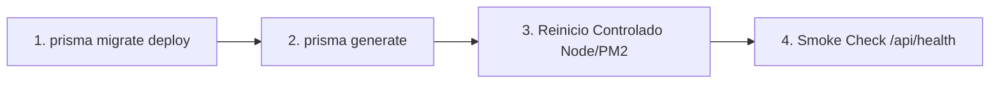

# Flujo Operativo de Release, Migraciones Prisma y Reinicio de Servicio

Fecha: 2026-09-03
Proyecto: Plastimar ERP v2
Ámbito: Backend / Base de Datos / Operaciones y DevOps
Objetivo: Prevenir caídas HTTP 500 (desincronización de esquema Prisma Client en memoria) durante releases y migraciones.

---

## 1. Diagnóstico del Problema (Error 500 en Endpoints Migrados)

### Causa Raíz
Cuando se despliega una nueva migración SQL que agrega columnas o modelos a la base de datos (por ejemplo, el campo `saldo` en `PagoProveedor` o la flexibilización de constraints en `BitacoraTaller`):
1. Si el cliente Prisma no se regenera (`prisma generate`), el código de la aplicación intentará invocar métodos con tipos o selectores que el cliente compilado localmente desconoce.
2. Incluso si se ejecuta `prisma generate`, los procesos Node.js / Fastify de larga duración (como el demonio PM2 `plastimar-api` o el proceso local `node --watch`) mantienen en memoria la instancia del Data Model Meta Format (DMMF) cargada al inicio.
3. Al recibir una petición HTTP (por ejemplo `GET /api/pagos-proveedores`), Prisma Client arroja:
   ```text
   Unknown field 'saldo' for select statement on model 'PagoProveedor'.
   ```
   resultando en un error HTTP 500 para los usuarios del ERP.

---

## 2. Secuencia Obligatoria de Despliegue (Order of Operations)

Todo release que contenga cambios de base de datos o modelos Prisma **DEBE** ejecutarse en el siguiente orden estricto:



### Paso 1: Aplicar Migraciones en Base de Datos
Ejecuta las migraciones pendientes sobre la base de datos destino:
```bash
# Entorno Docker Local (Desarrollo):
npm run db:migrate:docker

# Entorno Docker Pruebas (plastimar_test):
npm run db:migrate:test:docker

# Entorno VPS / Staging / Producción:
npx prisma migrate deploy
```

### Paso 2: Regenerar el Cliente Prisma
Genera los tipos y metadatos actualizados en `node_modules/.prisma/client`:
```bash
npx prisma generate
# o mediante el script empaquetado:
npm run db:generate
```

> **Nota combinada:** En `backend/package.json` se dispone de comandos que encadenan los pasos 1 y 2 de forma atómica:
> - `npm run db:release:docker` (desarrollo local docker)
> - `npm run db:release:test:docker` (suite de pruebas docker)

### Paso 3: Reinicio Controlado del Proceso Backend
El proceso Node.js debe reiniciarse para desechar el DMMF antiguo y cargar el nuevo cliente:
- **En VPS / Producción (PM2):**
  ```bash
  pm2 reload ecosystem.config.cjs --update-env
  # o si se requiere reinicio completo:
  pm2 restart plastimar-api --update-env
  ```
- **En Entorno Local de Desarrollo:**
  Detener el proceso activo (`Ctrl+C` si corre en terminal o matar PID específico) y volver a ejecutar:
  ```bash
  npm run dev:docker
  ```

### Paso 4: Verificación Posterior (Smoke Test)
Validar que el servicio responde y que los endpoints migrados están operativos:
1. Salud general:
   ```bash
   curl -fsS http://127.0.0.1:3001/api/health
   ```
2. Endpoint migrado (ejemplo tesorería proveedores):
   ```bash
   curl -fsS -H "Authorization: Bearer <TOKEN>" http://127.0.0.1:3001/api/pagos-proveedores
   ```

---

## 3. Consideraciones en CI/CD (`.github/workflows/deploy.yml`)

El pipeline automatizado de GitHub Actions debe asegurar que:
1. Las migraciones se apliquen antes de iniciar o reiniciar la aplicación productiva.
2. `npx prisma generate` se ejecute en el servidor destino después de actualizar dependencias o aplicar migraciones.
3. El comando de reinicio (`pm2 startOrReload ecosystem.config.cjs --update-env`) se ejecute inmediatamente después de la compilación y preparación de la base de datos.
4. El paso `Smoke API` valide el endpoint `/api/health` y la suite de smoke funcional antes de dar el release por finalizado.
