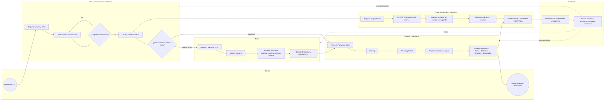
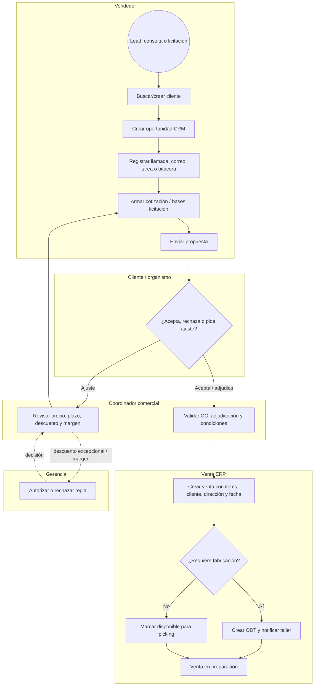
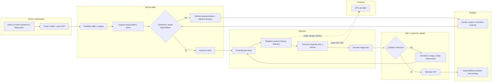
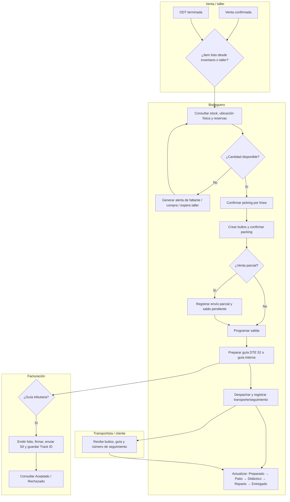
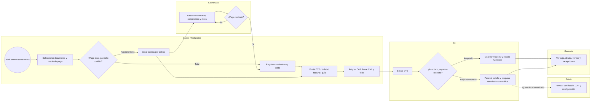
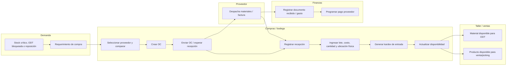
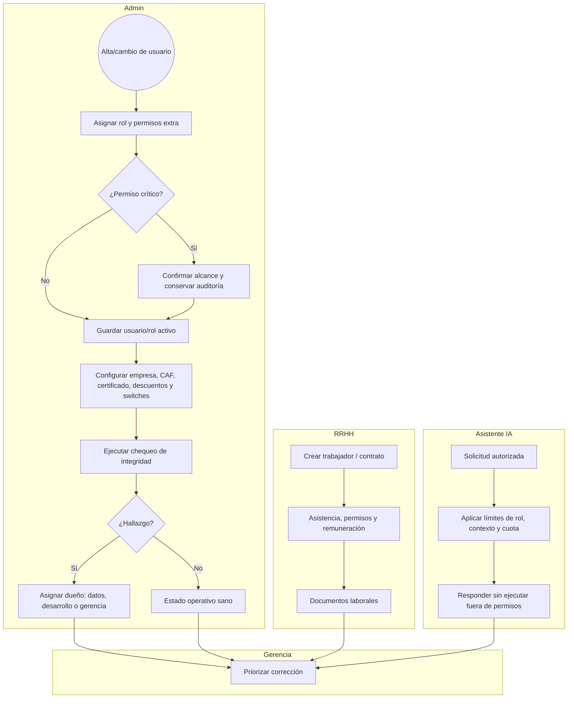
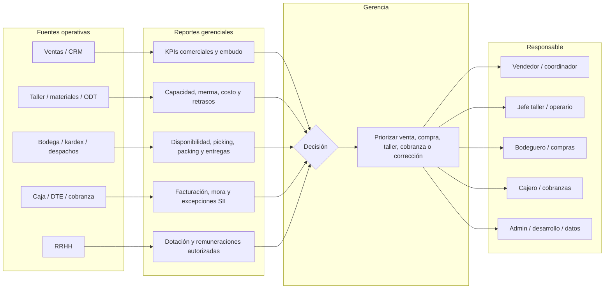

# Mapas BPMN operacionales — Plastimar ERP

Fecha de corte: 2026-09-02. Alcance: flujo vigente en el código local y trazas E2E de `plastimar_test`; no describe procesos de producción.

Estos mapas usan carriles BPMN en Mermaid: círculo = inicio/fin, rectángulo = actividad, rombo = decisión, y cada flecha representa una entrega de información, un cambio de estado o una responsabilidad que pasa a otro rol.

## Roles y responsabilidad operativa

| Rol / actor | Inicia o mantiene | Entrega a |
| --- | --- | --- |
| Vendedor | Cliente, CRM, cotización, licitación, venta y comunicación comercial | Coordinador, taller, bodega, caja/cobranza |
| Coordinador comercial | Revisión comercial, aprobación y seguimiento de ventas | Taller, bodega, gerencia |
| Jefe de taller | ODT, asignación, calidad, cierre de orden | Bodega, vendedor, gerencia |
| Operario de taller | Avance, tiempos, consumo/merma y etapa lista | Jefe de taller |
| Bodeguero | Picking, packing, despacho, guía DTE 52 y tracking | Transporte, cliente, facturación, gerencia |
| Cajero / facturador autorizado | Turno, cobro, pago, DTE, nota interna y conciliación de caja | Cobranza, SII, gerencia |
| Cobranzas | Cuenta por cobrar, gestión, compromiso y cierre de deuda | Cliente, caja, gerencia |
| Compras / bodega | Proveedor, OC, recepción, kardex, inventario y ubicación física | Taller, ventas, gerencia |
| RRHH | Trabajador, contrato, asistencia, remuneración y documentos laborales | Gerencia |
| Admin | Usuarios, roles, parámetros fiscales, descuentos, IA e integridad | Todos los módulos |
| Gerencia / solo lectura | KPI, excepciones, márgenes, trazabilidad y decisiones | Responsable del área |
| Cliente / proveedor / SII / transporte | Actor externo que recibe o confirma información | Rol interno responsable |

## 1. Mapa global: cliente a cierre y retroalimentación

**Traspasos que no deben perderse:** venta/ítems → ODT; ODT terminada → disponibilidad logística; despacho/packing → guía; guía/DTE → venta; pago y entrega → cierre formal; todos los eventos → auditoría y reportes.

## 2. Venta, CRM, cotización y licitación

Estados relevantes: CRM `NUEVO → SEGUIMIENTO → CERRADO/GANADO o PERDIDO`; venta `Pendiente → En preparación → Despacho → Entregada`; las licitaciones pueden portar plazo y riesgo de multa hacia despacho.

## 3. Taller: pasar a taller, ODT, bitácora y materiales

Controles: el operario sólo registra avance; el jefe asigna, aprueba calidad y cierra. El consumo deja historial de materiales, lote y merma; no equivale a una salida comercial.

## 4. Bodega: inventario, compras, picking, packing y despacho

Ruta alternativa: un **despacho aislado** nace en Bodega con motivo obligatorio y destinatario, sin crear ni falsificar una venta; puede preparar su propia guía. La ubicación física es el dato maestro `ubicación física` del producto, no una inferencia del picking.

## 5. Caja, facturación, documentos SII y cobranza

Regla: emisión, envío SII y consulta de estado son pasos separados. Un rechazo o una respuesta no confirmada conserva el folio y requiere conciliación; nunca crea automáticamente un segundo DTE.

## 6. Compras e inventario

## 7. RRHH, administración, permisos, IA e integridad

Reglas de gobierno: Admin no puede dejar sin administrador activo ni auto-revocarse; los permisos específicos prevalecen sobre los de módulo; `solo_lectura` no ve remuneraciones; la IA no amplía permisos del usuario.

## 8. Reportería y circuito de decisión

## Matriz de llegada de información

| Evento de origen | Receptor inmediato | Datos mínimos entregados | Resultado esperado |
| --- | --- | --- | --- |
| Venta confirmada | Taller o Bodega | Orden, interno, cliente, líneas, cantidades, fecha y tipo | ODT o cola de picking |
| Etapa/ODT terminada | Bodega | ODT, producto, cantidad, calidad y observaciones | Producto disponible para preparación |
| Picking/packing confirmado | Despacho | Líneas, cantidades, bultos, responsable y saldo | Salida programable / parcial |
| Guía emitida | SII, cliente, venta y gerencia | Folio, XML, receptor, ítems, Track ID y estado | Trazabilidad tributaria y logística |
| Pago o compromiso | Cobranza, caja y venta | Monto, medio, fecha, documento y saldo | Deuda actualizada / cierre si corresponde |
| Consumo de material | Taller, bodega y gerencia | ODT, lote, cantidad, merma, trabajador y fecha | Costo real, stock y KPI de merma |
| Hallazgo de integridad | Dueño asignado | Entidad, ID, evidencia, severidad y causa | Corrección de datos, código o decisión |

## Evidencia de implementación consultada

- Roles y restricciones: `backend/src/middleware/rbac.js`.
- Venta a despacho y estados: `backend/src/routes/ventas/estado-flujo-formal.js`, `backend/src/routes/despachos/`.
- Taller y avance: `frontend/src/pages/taller/`, `frontend/src/pages/pasar-taller/`, `frontend/src/pages/bitacora-taller/`.
- DTE/SII: `backend/src/facturacion/engine.js`, `frontend/src/pages/facturacion/`.
- Trazas reales de roles: `docs/auditoria/TRAZA_SEMANA_OPERATIVA_E2E_2026-09-02.md`.
