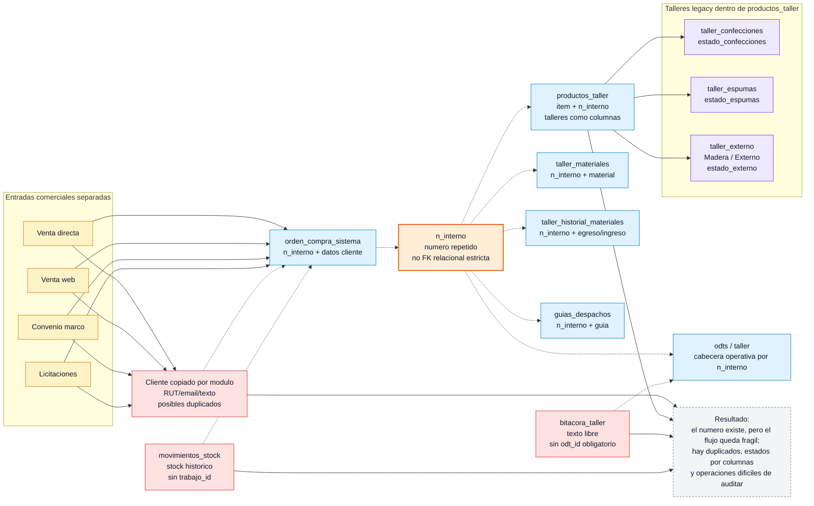
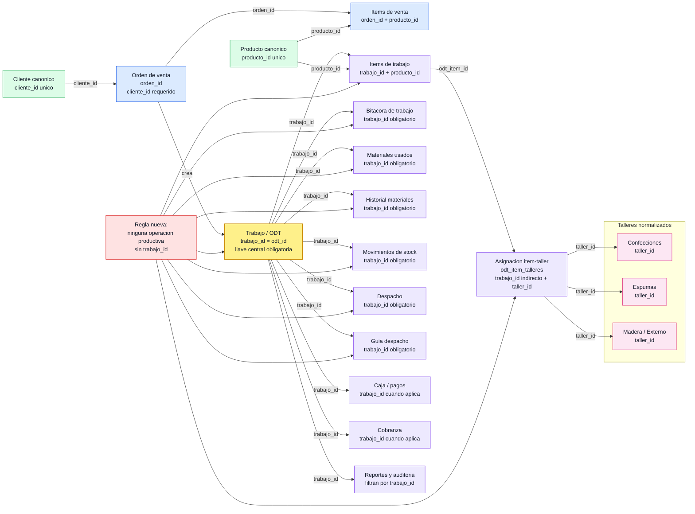

# Flujos ERP viejo vs ERP nuevo - 2026-05-19

Objetivo del documento: mostrarle al cliente, de forma visual, el punto de partida y el flujo al que vamos.

El ERP viejo usaba `n_interno` como numero comun entre varias tablas, pero sin una relacion relacional fuerte. El ERP nuevo debe usar un `trabajo_id / odt_id` obligatorio como llave de trazabilidad para toda operacion productiva.

## Chart 1 - Aqui partimos: ERP viejo legacy

## Chart 2 - Aqui vamos: ERP nuevo objetivo

Notas de revision:

- En el ERP viejo, el dump confirma que `productos_taller` tiene columnas `taller_confecciones`, `taller_espumas` y `taller_externo`.
- En el PHP legacy, `taller_externo` se presenta al usuario como Taller Madera.
- En el ERP nuevo, el legacy no debe ser flujo operativo: solo sirve como antecedente de migracion y reconciliacion.
