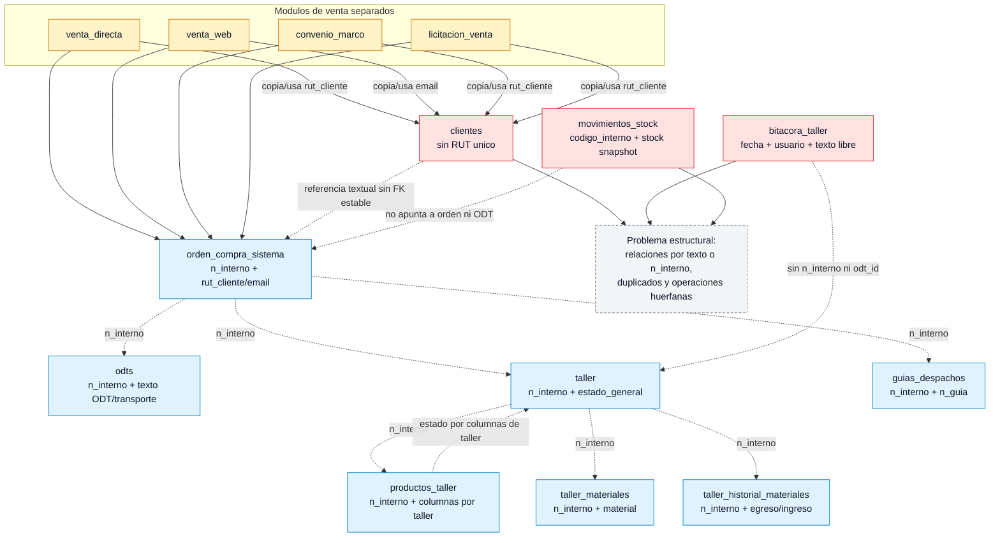
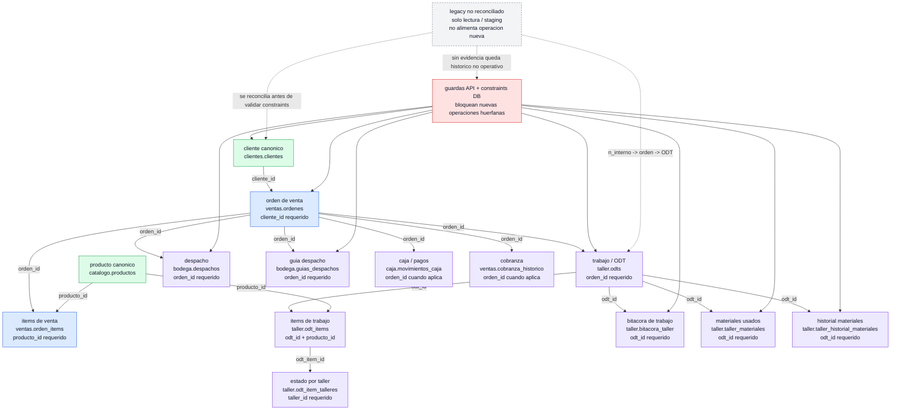

# Flujos ERP viejo vs ERP nuevo - 2026-05-19

Este documento contiene dos charts Mermaid:

1. flujo real observado en el ERP PHP legacy;
2. flujo objetivo obligatorio para el ERP nuevo.

## Chart 1 - ERP viejo legacy

## Chart 2 - ERP nuevo objetivo

