# Mapa de modulos y funciones - ERP viejo vs ERP nuevo

Fecha: 2026-05-19

Objetivo: comparar el ERP PHP legacy contra el ERP nuevo por modulos y funciones visibles. Este documento separa dos cosas: que hacia el sistema viejo y como queda organizado el sistema nuevo.

Fuentes revisadas:

- ERP viejo: `menu_top.php`, `home.php` y carpetas PHP del proyecto `sisgestion`.
- ERP nuevo: `frontend/src/components/TopBar.jsx`, `frontend/src/router.jsx`, `backend/src/app.js` y rutas Fastify en `backend/src/routes`.

## Mapa 1 - ERP viejo legacy

```mermaid
flowchart TB
  classDef root fill:#111827,stroke:#111827,color:#ffffff,stroke-width:2px
  classDef module fill:#FEF3C7,stroke:#D97706,color:#111827,stroke-width:1px
  classDef weak fill:#FEE2E2,stroke:#DC2626,color:#111827,stroke-width:1px

  LEG["ERP viejo PHP<br/>sisgestion"]:::root

  LCFG["Configuracion<br/>perfil<br/>usuarios<br/>categorias y subcategorias<br/>proveedores<br/>cargos transporte<br/>descuentos<br/>gastos"]:::module
  LVENTAS["Ventas separadas<br/>venta sala: nueva y busquedas<br/>venta web: busquedas y OC<br/>convenio marco: nueva y busquedas<br/>licitaciones: cotizar y reportar"]:::weak
  LCLIENTES["Clientes<br/>listado<br/>buscar por nombre<br/>buscar por email<br/>referencias duplicables por modulo"]:::weak
  LBODEGA["Bodega productos<br/>mantencion productos<br/>busqueda por barra, interno, nombre, categoria, proveedor<br/>stock critico<br/>codigos repetidos<br/>faltantes de codigo/categoria/proveedor"]:::module
  LBODEGAT["Bodega taller<br/>materiales taller<br/>categorias propias<br/>busquedas<br/>stock critico<br/>codigos repetidos"]:::module
  LCAJA["Caja<br/>movimientos del dia<br/>ingresos y egresos<br/>cierre caja<br/>boletas<br/>busqueda por fecha, documento, interno, tipo venta"]:::module
  LCOBR["Cobranza / proveedores<br/>pagos proveedores<br/>boleta/factura proveedor<br/>facturas no pagadas<br/>boletas no pagadas<br/>busquedas por fecha/documento/proveedor"]:::module
  LTALLER["Taller matriz<br/>OT pendientes<br/>OT prioridad alta<br/>buscar por numero OT<br/>buscar por fechas<br/>buscar taller entre fechas"]:::weak
  L3T["Tres talleres separados<br/>taller_espumas<br/>taller_confecciones<br/>taller_externo = Madera<br/>cada uno con pendientes, prioridad y busquedas"]:::weak
  LBIT["Bitacora taller<br/>nueva bitacora<br/>buscar por fechas<br/>buscar por operario"]:::weak
  LMAT["Materiales e historial<br/>historial movimientos materiales<br/>inventario telas<br/>buscar por fechas, operario, taller"]:::module
  LING["Ingreso mercaderia<br/>facturas_bodega<br/>nueva boleta/factura<br/>busqueda por numero, fechas, documento, proveedor"]:::module

  LEG --> LCFG
  LEG --> LVENTAS
  LEG --> LCLIENTES
  LEG --> LBODEGA
  LEG --> LBODEGAT
  LEG --> LCAJA
  LEG --> LCOBR
  LEG --> LTALLER
  LEG --> L3T
  LEG --> LBIT
  LEG --> LMAT
  LEG --> LING
```

Lectura del mapa viejo:

- Ventas estaban separadas por modulo operativo: sala, web, convenio marco y licitaciones.
- Taller tenia una matriz general y tres accesos especializados: Espumas, Confecciones y Madera/Externo.
- Las funciones de taller se apoyaban en `n_interno` y columnas como `taller_confecciones`, `taller_espumas`, `taller_externo`.
- Clientes, ventas, taller, caja, despacho y stock no estaban obligados por una llave relacional unica de trabajo.

## Mapa 2 - ERP nuevo

```mermaid
flowchart TB
  classDef root fill:#064E3B,stroke:#064E3B,color:#ffffff,stroke-width:2px
  classDef module fill:#DCFCE7,stroke:#16A34A,color:#111827,stroke-width:1px
  classDef core fill:#DBEAFE,stroke:#2563EB,color:#111827,stroke-width:1px
  classDef work fill:#FEF08A,stroke:#CA8A04,color:#111827,stroke-width:2px

  NEW["ERP nuevo<br/>Fastify + Prisma + React"]:::root

  NDASH["Dashboard<br/>KPIs ventas, caja, taller y stock<br/>alertas operativas"]:::module
  NVENTAS["Ventas<br/>ordenes CRUD<br/>matriz ventas<br/>cargos y multas<br/>anular/activar<br/>imprimir<br/>licitaciones y cotizaciones<br/>crear venta desde cotizacion<br/>CRM comercial"]:::core
  NCLIENTES["Clientes canonicos<br/>crear/editar/listar<br/>historial de ventas<br/>historial ODT<br/>busqueda centralizada"]:::core
  NCAT["Catalogo y bodega<br/>productos CRUD<br/>historial precios<br/>movimientos stock<br/>importar precios/stock/nuevos<br/>consulta precios<br/>stock critico"]:::core
  NPROV["Proveedores y compras<br/>proveedores CRUD<br/>pagos proveedores<br/>ordenes de compra<br/>ingreso mercaderia<br/>stock-ingresos"]:::module
  NTALLER["Trabajo / ODT<br/>odt_id como llave productiva<br/>ODTs CRUD<br/>items de trabajo<br/>pasar a taller<br/>talleres normalizados<br/>Confecciones, Espumas, Madera/Externo"]:::work
  NMAT["Materiales taller<br/>bodega taller<br/>telas<br/>materiales usados<br/>historial materiales<br/>bitacora ligada a ODT"]:::work
  NDESP["Despacho y documentos<br/>despachos CRUD<br/>guias de despacho<br/>exportaciones operativas<br/>relacion con orden/trabajo"]:::module
  NCAJA["Caja y cobranza<br/>turno caja<br/>movimientos<br/>cierre<br/>historico<br/>cobranza por venta<br/>abonos y estados"]:::module
  NRRHH["RRHH<br/>trabajadores<br/>contratos<br/>liquidaciones<br/>anticipos<br/>licencias<br/>vacaciones<br/>EPP<br/>asistencias<br/>jornadas<br/>libros remuneracion"]:::module
  NADMIN["Admin y seguridad<br/>usuarios<br/>roles y permisos RBAC<br/>accesos<br/>auditoria<br/>integridad datos<br/>config empresa<br/>firmas<br/>bloqueos<br/>descuentos"]:::module

  NEW --> NDASH
  NEW --> NVENTAS
  NEW --> NCLIENTES
  NEW --> NCAT
  NEW --> NPROV
  NEW --> NTALLER
  NEW --> NMAT
  NEW --> NDESP
  NEW --> NCAJA
  NEW --> NRRHH
  NEW --> NADMIN
```

Lectura del mapa nuevo:

- Ventas queda concentrado como modulo comercial, con matriz, licitaciones, CRM y documentos relacionados.
- Cliente y producto pasan a ser maestros canonicos.
- Taller deja de depender de columnas por taller y pasa a ODT, items y asignaciones item-taller.
- La operacion productiva debe trazarse por `odt_id / trabajo_id`.
- Admin incorpora RBAC, auditoria e integridad de datos, funciones que el legacy no tenia formalizadas.

## Comparacion directa

| Ambito | ERP viejo | ERP nuevo | Cambio clave |
|---|---|---|---|
| Ventas | Sala, web, convenio marco y licitaciones separados | Ventas, matriz, licitaciones, CRM y cotizaciones bajo flujo comercial | Se unifica el origen comercial y se evita duplicar logica por canal |
| Clientes | Cliente copiado o referenciado por texto/RUT/email segun modulo | Cliente canonico con `cliente_id` | Un solo cliente para ventas, cobranza y taller |
| Productos | Bodega, precios y bodega taller separados | Catalogo central, historial precio, stock, consulta precios, bodega taller | Producto canonico con trazabilidad de movimientos |
| Taller | Matriz general mas tres carpetas: Espumas, Confecciones, Madera/Externo | ODT, items y asignaciones a talleres normalizados | El taller deja de ser columna y pasa a relacion item-taller |
| ID operativo | `n_interno` repetido entre tablas, sin FK fuerte | `orden_id` comercial y `odt_id / trabajo_id` productivo | La nueva regla debe impedir operaciones productivas sin trabajo |
| Bitacora | Texto libre por fecha/operario, sin ODT obligatoria | Bitacora ligada a ODT | La evidencia queda dentro del trabajo |
| Materiales | Materiales e historial por `n_interno` y taller texto | Materiales e historial ligados a ODT | Se puede auditar consumo por trabajo |
| Caja | Movimientos, ingresos, egresos, cierre, boletas | Turnos, movimientos, cierre e historico | Caja queda estructurada y relacionable con venta/trabajo cuando aplica |
| Cobranza | Mezcla con pagos proveedor y busquedas por documento/proveedor | Cobranza comercial y pagos proveedor separados | Se separa cobrar ventas de pagar proveedores |
| Ingreso mercaderia | `facturas_bodega` como flujo propio | `stock-ingresos` y pagos proveedor | Ingreso se conecta con proveedor, pago y stock |
| Despacho | Despacho/guias por `n_interno` | Despachos/guias relacionados con orden y trabajo objetivo | Despacho debe quedar trazable al flujo productivo/comercial |
| RRHH | No aparece como modulo fuerte en menu legacy revisado | Trabajadores, contratos, liquidaciones, asistencias, jornadas, libros | Es modulo nuevo formalizado |
| Seguridad | Niveles PHP por menu y usuario | RBAC por roles/permisos, accesos y auditoria | Control de permisos mas auditable |
| Integridad | No hay control formal de relaciones huerfanas | Admin integridad, guardas API y constraints DB | Se puede detectar y bloquear datos sin relacion |

## Resumen ejecutivo

El ERP viejo resolvia muchas funciones, pero las organizaba por pantallas y carpetas independientes. Eso explica la repeticion de clientes, la duplicacion de logica por tipo de venta y los estados de taller guardados como columnas.

El ERP nuevo debe presentarse al cliente como una reorganizacion funcional: mismos dominios operativos, pero con maestros canonicos, relaciones obligatorias y trazabilidad por orden/trabajo.
